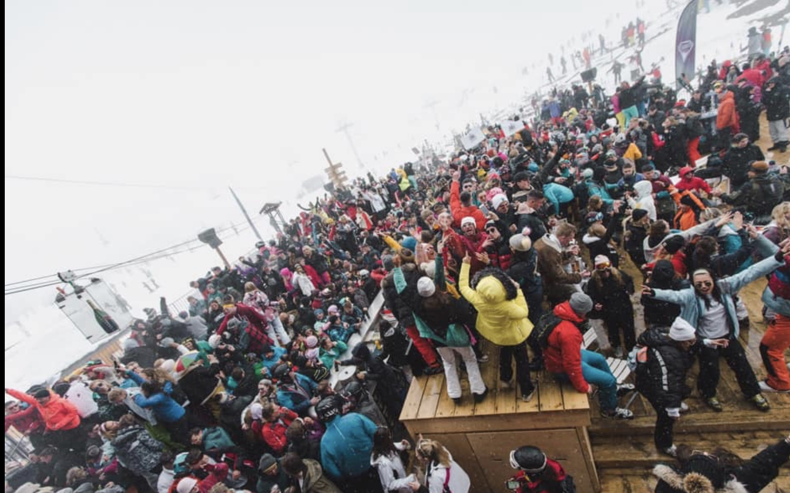

---
categories:
- ""
- ""
date: "2017-10-31T21:28:43-05:00"
description: "Click here for more information about the sports I play"
draft: false
#image: sport.JPG
keywords: ""
slug: sport
title: Sports
---

## **Welcome to the sixth tile of my website;**

Sport, where do i start. I've tried many and mastered none. My best sport however is Rugby, learning how to play from the age of 4 when my Dad set up my local rugby club, Knutsford RFC, and started teaching me the basics of tag. The club grew, we got coaches, multiple teams and warm showers, and i progressed slightly. 

Fast forward a few years, and i was playing first XV at St Ambrose and played for Sale FC at club level, who played in the top league of senior colts rugby. Playing with now professional players at these clubs and doing a refereeing course taught me much about the sport. I carried this through to university where i captained and co-led the Newcastle Law Team. We took the team from one without a kit and whom were bottom of the league, to one who had 2 teams, mid table and even went on rugby tour. Captaining taught me when to take the lead and when to take a step back. It meant a lot captaining the 'Law Blacks' as hopefully i've left a long lasting team in Newcastle.

Other than rugby, i love hacking my way around the golf course, and now i'm in London i have picked tennis and swimming back up.

My other sporting loves are skiing and any water activity, whether that be surfing, sailing, hydrofoilng, kitesurfing or wakeboarding. 

I've been fortunate enough to had the opportunity to go skiing from a young age, and it has bought along with it some of the best experiences ever, from dad's and lad's holidays to having 1500 uni students in the Folie Douche.

